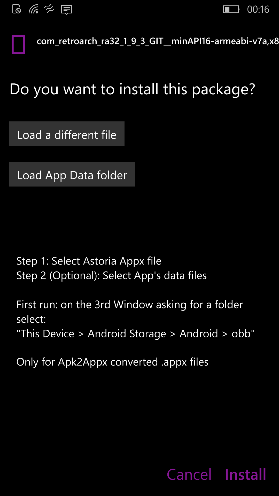

# Astoria Package Installer

A UWP installer for Apk2Appx converted Packages which is based off [UWP Package Installer](https://github.com/colinkiama/UWP-Package-Installer/releases) and aimed for Windows 10 Mobile devices running builds 10240 - 10570. Many thanks to @basharastifan on Telegram for help with much of the edits and helping fix a few issues!

This will allow users to install Android converted apps for Project Astoria, and copy the App/Game Data (*.obb files) to the Astoria system ready to use.

There will be [issues](#Issues) as this is my first attempt at UWP development. Work in progress!




# Requirements

- Windows 10 Mobile ARM build 10240 to 10570. 

- Astoria Container set up: Due to how Astoria is implemented, You need at least 1 Android application installed, or connect to the device with `wconnect.exe usb` once to 'Activate' the Android layer. (You can find `wconnect` with a simple search)

- A folder junction/link between phone storage and Astoria storage, more about this [below](#Note-About-First-Run)

- Android 4.4/[API Level 19](https://developer.android.com/studio/releases/platforms) app compatibility **only**. Use [Apk2Appx Converter](https://www.youtube.com/watch?v=XDDte4HUSjs) to convert APK files into usable APPX files.

  

# Recommendations

I highly suggest using this Installer with [WindOS Fone](https://www.youtube.com/channel/UCe-pdxB7iM6i__rIkRf7Kkg)'s [Tutorial on Installing Astoria](https://www.youtube.com/watch?v=vP-z8jVXVBQ) because it:

- Sets up Astoria depending on what device you have (x5x Devices are **NOT** Supported)
- Sets up the Astoria Container and link between Phone Storage and Astoria Storage.
- Unlocks the Bootloader on Astoria builds
- Automated and easy to use


# How to use

- Click the 'Load Appx' button to select the Appx you want to install.

- If the Android App has game data, click 'Load App Data Folder' (data folders usually in the name format: `com.developer.appname`)

- Click 'Install'

  

### NOTE ABOUT FIRST RUN

Due to UWP Limitations, Astoria Package Installer needs the user to select the *Destination* of the Android App Data. This will only be needed **once**. Users will be asked to select a folder 2 times when clicking `Load App Data Folder`, **first** is the Game data you want to copy, **second** is the Astoria Storage.

If you used the [Project Astoria](https://www.youtube.com/watch?v=vP-z8jVXVBQ) Updater tool then you can use this path, when asked for the **second** time:

- `This Device > Android Storage > Android > obb >`


If you have manually installed Astoria or used a different method, you need to set up a Folder Junction on the device, this requires [CMD Injector](https://www.youtube.com/watch?v=MuHGy4Yei7o) as you need access to the Command Prompt on the device.

- Make sure at least 1 Android App installed or connect with `wconnect.exe`, to make sure the Astoria Container is mounted.

- Open Command Prompt session (Telnet) on the device following the [CMD Injector](https://www.youtube.com/watch?v=MuHGy4Yei7o) tutorial.

- Type:

  ```batch
  mklink /J "C:\Data\Users\Public\Android Storage" "C:\Data\Users\DefApps\AppData\Local\aow\mnt\shell\emulated\0\" 
  ```

- Make sure the Link has been made by checking File Manager on the device.


# Issues

- There may be some crashes with Folder Picker crashing, this is a bug related to File Manager in some Astoria builds afaik
- When loading Astoria Package Installer for the **first** time, the 3rd popup asking to select folder may hang at opening "This Device > Android Storage". This is due to that folder being outside the User Documents area. Close and reopen the Package Installer, If issue persists, verify the folder is accessible with File Manager


# Notes

- This is **NOT** Intended with use on builds higher than 10570. Astoria supported builds **ONLY**.

- This **cannot** be used to install Windows Mobile UWP Applications.

- Most Google Services features will not be available in Installed Android Apps

  


# Useful links and guides

- [Project Astoria Telegram](https://t.me/joinchat/kgVNg8Bma343MzY1) - A Telegram group for all things Astoria, and for Updates on [WindOS Fone](https://www.youtube.com/channel/UCe-pdxB7iM6i__rIkRf7Kkg)'s Astoria tools and support, you can also ask for help about this app in there.
- [Apk2Appx Converter](https://www.youtube.com/watch?v=XDDte4HUSjs) - A handy tool for converting `.apk` files to `.appx` to install with Astoria Package Installer.

- [XDA Manually Deploying Astoria](https://forum.xda-developers.com/t/guide-deploying-astoria-packages-manually-to-w10m.3214481/) -  A Dated guide on manually deploying Astoria builds to devices.

  


 


